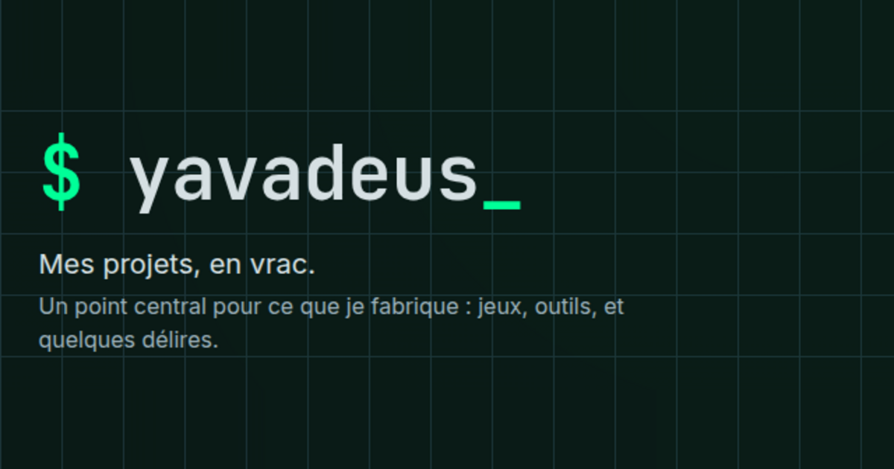

# yavadeus


Page perso qui rassemble tous mes projets au même endroit : jeux, outils et
délires. Bilingue, statique, esthétique dark / dev, et **auto-générée depuis
GitHub**. Fait aussi office de CV.




---

## Fonctionnalités

- **Catalogue auto-découvert** - une étape `fetch` liste tous les repos non-fork du compte GitHub ; un repo n'apparaît qu'une fois qu'on lui donne une catégorie
- **Enrichissement automatique** - titre, sous-titre, technos, favicon, étoiles, dates, liens, badges : presque tout est déduit, rien à saisir à la main
- **Vignettes auto** - capture du site live (microlink), sinon de la page npm, sinon image sociale GitHub ; normalisées en WebP 720×405 (~13 Ko), committées, re-générées seulement quand le projet change
- **Sous-titres bilingues traduits** - la description GitHub est traduite FR ↔ EN au moment du fetch (l'override manuel reste prioritaire)
- **Technos + frameworks** - langages GitHub enrichis du framework réel lu dans le `package.json` (React, Next.js, Vue, Astro, Tauri...)
- **Détections fines** - usage d'un agent IA (`AGENTS.md` / `CLAUDE.md` / `.claude`), bot Discord (mention dans le README), release téléchargeable, paquet npm publié sous le bon mainteneur
- **Bilingue FR / EN** - routing natif Astro (FR sur `/`, EN sur `/en/`), avec switch
- **3 vues** - par **Rubriques** (jeux / outils / délires / marmelab), par **Création** ou par **Mise à jour**, ces deux dernières en timeline groupée par année
- **Recherche instantanée** - filtre client sur titre, sous-titre et technos, insensible aux accents
- **Mode « ouvert d'esprit »** - les délires sont floutés derrière un interrupteur, mémorisé pour la session
- **En-têtes sticky, responsive mobile, accessibilité soignée** - navigation clavier, focus visible, icônes décoratives masquées aux lecteurs d'écran
- **Cartes de partage** - balises Open Graph / Twitter, image 1200×630
- **100 % statique et hors-ligne** - le cache est committé, donc le build (et les déploiements) ne touchent ni au réseau ni à un token

---

## Pipeline (fetch → curate → build)

Trois étapes découplées, seule la première touche au réseau :

```
  make fetch   (réseau, token GitHub via `gh` ou GITHUB_TOKEN)
       │   snapshot GitHub + npm  ──▶  src/data/projects-cache.json  (committé)
       ▼
  make curate  (local, hors-ligne)
       │   catégorie · WIP · ignore · prune  ──▶  src/data/projects.ts
       ▼
  make build   (hors-ligne, sans token)
       │   cache + overrides  ──▶  dist/   (statique, prêt à déployer)
       ▼
     Vercel
```

Le cache committé est l'unique source du build : **dev, build et déploiement
tournent sans réseau ni token**. Seul `make fetch` en a besoin.

---

## Démarrage rapide

```bash
make install   # installe les dépendances
make fetch     # snapshot des données GitHub/npm dans le cache (via ton login `gh`)
make dev       # serveur de dev sur http://localhost:2107 (hors-ligne)
```

`make help` liste toutes les commandes.

### Générer une version à jour (avant déploiement)

```bash
make fetch     # 1. rafraîchit le cache (réseau)
make curate    # 2. (seulement si des repos ont été créés/supprimés) catégorise / prune
make build     # 3. rend le site statique depuis le cache (hors-ligne)
make preview   #    (optionnel) prévisualise sur http://localhost:2107
```

Pour un simple rafraîchissement de données (étoiles, dates, descriptions),
`make fetch` puis `make build` suffisent ; l'étape 2 n'est utile que quand
**l'ensemble** des repos change.

---

## Stack technique

| Couche     | Technologie                                            |
| ---------- | ------------------------------------------------------ |
| Framework  | Astro 6 (sortie statique, aucun JS client par défaut)  |
| Contenu    | Content Layer (`astro:content`), schéma Zod            |
| i18n       | routing natif Astro (FR `/`, EN `/en/`)                |
| Langage    | TypeScript strict                                      |
| Styles     | CSS scopé + custom properties (ni Tailwind, ni lib UI) |
| Données    | API GitHub + registre npm (étape `fetch`)              |
| Traduction | google-translate-api-x (au `fetch`)                    |
| Tests      | Vitest (logique pure)                                  |
| Formatage  | Prettier (+ `prettier-plugin-astro`)                   |
| Scripts    | tsx                                                    |

---

## Services externes

Tous sont appelés **uniquement à l'étape `fetch`** : le résultat est mis en
cache, donc le site déployé n'en dépend pas. Seule exception, Google Fonts,
chargé par le navigateur au runtime.

| Service                                                                        | Usage                                                           |
| ------------------------------------------------------------------------------ | --------------------------------------------------------------- |
| [API REST GitHub](https://docs.github.com/rest)                                | repos, langages, commits, releases, README, marqueur IA         |
| [registre npm](https://registry.npmjs.org)                                     | détection du paquet npm publié                                  |
| [microlink](https://microlink.io)                                              | captures d'écran (sites live, pages npm) pour les vignettes     |
| image sociale GitHub (`opengraph.githubassets.com`)                            | vignette de repli (ni site live, ni npm)                        |
| [google-translate-api-x](https://www.npmjs.com/package/google-translate-api-x) | traduction FR/EN des sous-titres (endpoint Google non officiel) |
| [ImageMagick](https://imagemagick.org) (`convert`)                             | redimensionnement local des vignettes en WebP (outil système)   |
| [Google Fonts](https://fonts.google.com)                                       | polices Inter + JetBrains Mono (**chargé au runtime**)          |

Authentification GitHub : `gh auth token`, sinon `GITHUB_TOKEN`. Aucun autre
service ne requiert de clé.

---

## Ajouter / organiser un projet

Un repo ne s'affiche **qu'une fois qu'il a une catégorie**. Deux façons :

- **Interactif** : `make curate` (ou `make categorize`) liste les repos non
  catégorisés et demande catégorie (jeux / outils / délires / marmelab), WIP ou
  ignore. Écrit dans [`src/data/projects.ts`](src/data/projects.ts).
- **À la main** : éditer la map `projects`, clé = nom du repo :

  ```ts
  'mon-repo': {
    category: 'outils',              // requis pour l'afficher
    // optionnel : title, subtitle {fr,en}, live, npm, download, favicon, tech, ai, thumbnail, wip
  }
  ```

Pour chaque champ, **l'override manuel l'emporte, le cache comble le reste**. Un
nouveau repo doit d'abord être `fetch`-é pour entrer dans le cache. Les forks ne
sont jamais affichés ; les repos `ignored` sont ignorés.

---

## Architecture

```
src/
├── config.ts            # config depuis .env (GITHUB_USER, NPM_USER, SITE_URL)
├── data/
│   ├── projects.ts      # catalogue curé : catégories + overrides + ignored
│   └── projects-cache.json  # snapshot committé écrit par `make fetch`
├── lib/
│   ├── sources/         # fetchers GitHub/npm, découpés par domaine (étape fetch)
│   ├── cache.ts         # type du cache + lecture (source hors-ligne)
│   └── projects-loader.ts   # fusionne cache + overrides
├── scripts/home-view.ts # helpers purs de la vue client (recherche, années)
├── i18n/ui.ts           # chaînes FR/EN + helpers de locale
├── layouts/Layout.astro # <head>, fonts, balises OG/Twitter
├── components/          # HomePage.astro, ProjectCard.astro, Footer.astro
└── pages/               # FR sur /, EN sur /en/
scripts/                 # fetch.ts (réseau) + pipeline de curation
tests/                   # tests unitaires Vitest (logique pure)
```

Voir [AGENTS.md](AGENTS.md) pour l'architecture détaillée, les règles de code et
les pièges connus.

---

## Développement

```bash
make start         # serveur de dev en arrière-plan
make stop          # l'arrête
make test-unit     # tests unitaires Vitest
make format        # Prettier --write
make typecheck     # astro check
make check         # format + typecheck + tests + build (gate CI)
make clean-data    # DESTRUCTIF : remet à zéro cache + catalogue (confirmation requise)
```

La logique pure (parsing, ranking, fusion, traduction, recherche) est isolée
dans des helpers exportés et **couverte par les tests** ; l'I/O réseau et le DOM
sont volontairement hors périmètre. Lancer `make check` avant de committer.

---

## Déploiement

Le build est statique et hors-ligne (`dist/`), donc déployable tel quel. Cible
visée : **Vercel** (`SITE_URL` dans `.env`). Comme le cache est committé, la
plateforme build sans réseau ni token.
